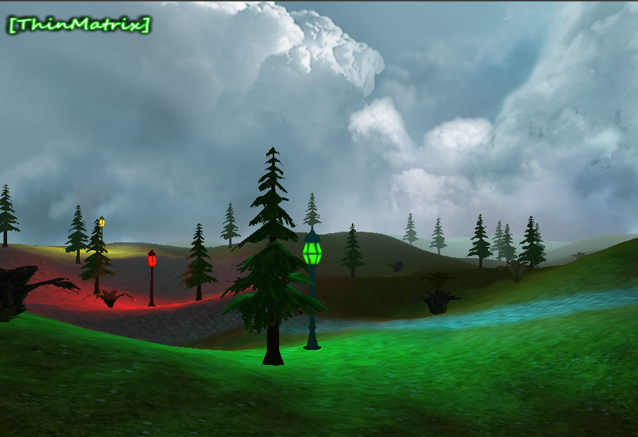

# OpenGL 3D Game Engine

This is a C++ implementation of the [ThinMatrix OpenGL 3D Game Engine tutorial series](https://www.youtube.com/playlist?list=PLRIWtICgwaX0u7Rf9zkZhLoLuZVfUksDP). The code requires [SFML](http://www.sfml-dev.org/index.php), [GLEW](http://glew.sourceforge.net/), and [GLM](http://glm.g-truc.net/).

Thanks for stopping by! :)
